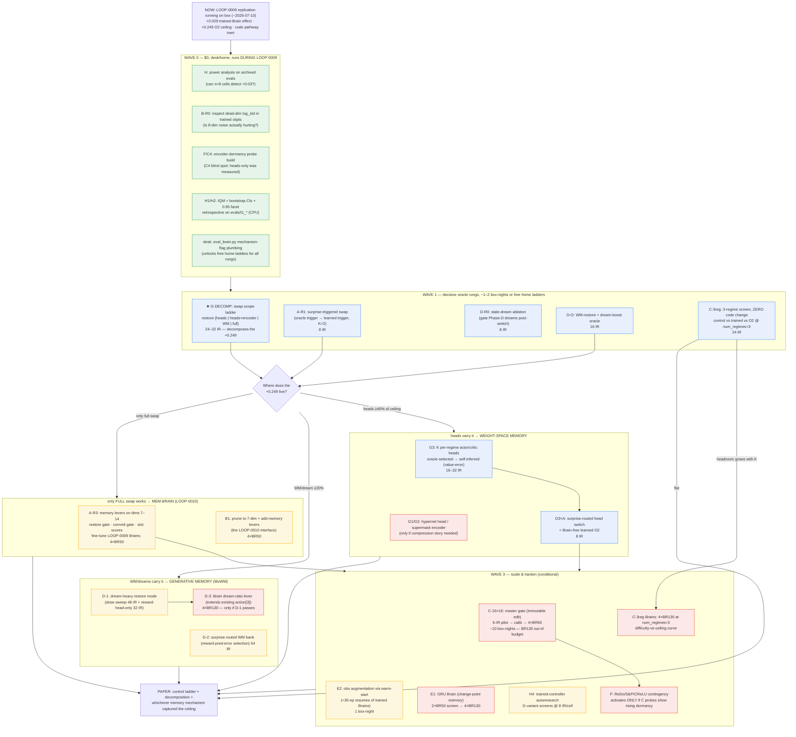
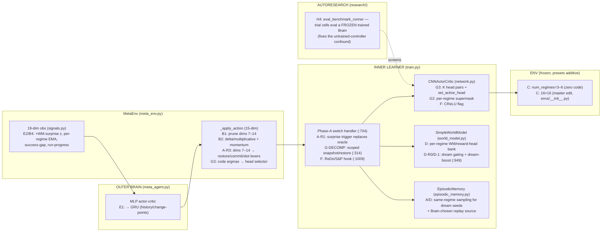

# Research Action Tree — where the project branches after LOOP-0009 (2026-07-09)

**What this is:** the strategic option tree the 2026-07-08 hand-off asked for — every viable
research direction, its mechanism *in the Brain→inner-learner pipeline* (verified against
source, file:line), its GPU cost, its kill criterion, and how branches intersect if they
succeed. Produced from the verified literature map ([note 0010](../research-notes/0010-related-work-literature-map.md))
plus an 8-agent source-verification pass (2026-07-09).

**Compute currency (measured, LOOP-0009):**

| Unit | Meaning | Cost |
| --- | --- | --- |
| **IR** | one inner run (800k steps, 16 envs) | ~22 min on a box GPU (4060 Ti, SPS ~600); ~8 min as a home-5070 eval |
| **BR50 / BR130** | Brain training, 50 / 130 episodes | ~15 h / ~40–48 h per box GPU |
| **box-night** | 12 h × 4 GPUs @ ~$1–1.5/hr | ~$12–18 (box is RAM-bound: ≥24 GB RAM/GPU) |
| **home ladder** | eval-only n=32×2 arms on the 5070 | ~9 h, **$0** |

**Status (2026-07-14):** LOOP-0009 gate → **P-R1a PASSED** (pooled Δ+0.0455, 3/4 seeds; C1 is
across-training-seeds; paper v1 in `paper/`). Box gone (unreachable; destroy pending human
confirmation in the Vast console) — re-provision at Wave 2 per standing decision 2. **Wave 0:
W0a/W0b/W0d DONE** ([note 0011](../research-notes/0011-wave0-desk-probes.md)): H4's registered
kill FIRED (power 0.24@n8 / 0.49@n16 for +0.029 — screening returns only via a re-registration
with MDE ≥ +0.05, human call); B-R0 confirms the B1 dead-dim-noise premise (trained σ on code
dims 0.605 ≈ init 0.607, all 5 Brains); IQM/stratified-CI clean (pooled ΔIQM +0.0527, CI
[+0.033,+0.058]); exploratory hit95 facet moves with training (+0.143 t1 / +0.071 pooled).
**W0e DONE 2026-07-14:** `swap_scope` ({heads | heads+encoder | world_model | full}) plumbed
through `_snapshot_learner`/`_restore_learner` + `init_inner_training` + `eval_brain.py`
(`--policy_swap_topline --swap_scope`), flag-guarded default-off, unit-tested + smoke-verified
end-to-end (banked at first switch, restored on revisits, flags in eval config.txt) — **the
G-DECOMP ladder is now launch-ready as free home evals.** Remaining before Wave 1: W0c
(encoder-dormancy probe build) — and a human go for the ladder itself (never-idle pause).
**W0c DONE 2026-07-17** (LOOP-0016, $0, 8/8, pre-reg log 0014): **P-W0c1 FAILED — first-conv-layer
encoder dormancy accumulates (0.13→0.48 median, τ-robust) while conv2/3 and heads fall** →
paper C4 scope-corrected ([note 0014](../research-notes/0014-encoder-dormancy-probe.md));
**branch F's activation condition is now met** (rising dormancy observed, layer-local, at 8×8)
— any F intervention run remains a NEW registration + human call.

**WAVE 1 RESOLVED 2026-07-14 same-day** ([LOOP-0011](../autoresearch-loops/LOOP-0011-wave1-oracle-rungs.md),
[note 0012](../research-notes/0012-ceiling-decomposition.md), pre-reg [log 0008](../research-log/0008-2026-07-14-wave1-oracle-rungs-preregistration.md)):
**GATE ANSWERED — the +0.249 lives in the heads.** share(heads) +89.6%, +encoder +96.3%,
world_model −8.2% (null), optimizer ~4%; ceiling protocol-robust (H=+0.2434 at eval protocol).
**→ W2A opens (G3 per-regime heads, then G3×A learned-O2). W2B/D closed at its oracle rung
(D-R0/D-O/D-1/D-2/D-3 struck). C scaling axis dead** (K=3 premium +0.2351 ≤ K=2 +0.2434;
C2/3b lose their rationale). Trained-vs-init attenuates at K=3 (+0.020, p=0.13, descriptive).
Next: G3 build + A-R1 trigger (home, $0); box ping at the A-R3/B1 fine-tune stage.

**Standing constraints:** LOOP-0009 owns the box until ~2026-07-10; never-idle-box is PAUSED —
nothing launches without a human call. n≥8 + convergence-vs-decay discipline everywhere.
Controller-touching screens must use a **trained** Brain (March ep130 now; LOOP-0009's four
Brains once landed). The frozen benchmark/scorer/env surface is immutable; presets are
master-additive; `envs/__init__.py` (16×16 registration) is a **master-level** edit.

---

## 1. The tree

Root fact driving everything: HP meta-control is worth **+0.029**; the zero-forgetting swap
ceiling is worth **+0.249**; the code→mask pathway is **inert**. The tree therefore points
almost all compute at *decomposing and then capturing the +0.249*, with the action-space and
scale axes as the vehicles, and everything gated by cheap oracle rungs before any BR spend.

Legend: green = $0 · blue = ≤1–2 box-nights or free home ladders · yellow = 1–3 box-nights
(BR50-scale) · red = ≥4 box-nights (BR130-scale / 16×16).

**The single most important edge:** ★ G-DECOMP. The 8-agent source pass found that
[`_snapshot_learner`](../../src/lifelong_learning/agents/ppo/train.py#L314) deep-copies the
policy **and** the world model **and** both Adam states — so the +0.249 "policy-swap" ceiling
is actually an *unattributed mixture* of policy memory, world-model memory, and optimizer
curvature memory. A key-filtered swap (`heads` / `heads+encoder` / `world_model` / `full`)
decomposes it for 24–32 IR (≈ one free home-eval afternoon) and **routes every other memory
branch**: A, D, and G all consume its answer, so it runs first, and the three Wave-2 subtrees
are mutually exclusive *only in priority* — the gate says which one gets the first BR spend.

---

## 2. Where each branch plugs into the pipeline

---

## 3. Branch dossiers (mechanism · cost · kill · intersections)

### A — Memory-facing meta-control (mem-Brain) — **small-build**

**Mechanism.** Everything hard already exists as the O2 oracle:
[`_snapshot_learner`/`_restore_learner`](../../src/lifelong_learning/agents/ppo/train.py#L314-L336)
bank/restore the full learner keyed by regime, fired by the Phase-A switch handler
([train.py:704](../../src/lifelong_learning/agents/ppo/train.py#L704)) off ground-truth
`regime_id`. Three de-oracling rungs: **R1** swap the trigger to the existing
change-point detector [`_update_surprise_spike`](../../src/lifelong_learning/agents/ppo/train.py#L215-L232)
(at K=2 selection is degenerate — "restore the other one" — so R1 isolates the *trigger*,
the only oracle ingredient); **R2** content-addressable selection by argmin banked-WM
reward-prediction error (thin signal — regimes share dynamics, differ only in reward);
**R3** the mem-Brain: repurpose the inert dims 7–14 in
[`MetaEnv._apply_action`](../../src/lifelong_learning/agents/brain/meta_env.py#L487-L494)
as restore-gate (>0.5, with cooldown), commit-gate, and K=4 slot scores. Keeping the 15-dim
action means **LOOP-0009 Brains fine-tune into mem-Brains** (BR50, not from-scratch BR130).
Source fact that shapes the design: the 19-dim obs contains switch-*timing* signals but **no
regime identity** — the Brain can learn WHEN, never WHICH; selection is delegated to R2 or
K=2 degeneracy.

**Cost.** R1 decisive: 8 IR (~3 GPU-h, or free home ladder). Full campaign ≈ 2–2.5 box-nights
($24–40) + 2 home-eval days, incl. 4×BR50 fine-tunes.
**Kill.** R1 at n=8 with a trained Brain: gain < +0.05 OR trigger precision < 60% ⇒ if the
inner surprise signal can't recover the trigger with free selection, no Brain gate at 10×
coarser cadence (decision_interval ≈ 20% of a regime) can — mem-Brain premise dead.
**Intersects.** G (shared decomposition + trigger drops into G3's head-switch), D (trigger
routes WM restore), E (obs features supply WHICH; GRU supplies WHEN), B (pruned 7-dim base is
the lever vehicle — this is LOOP-0010's interface).

### B — Action-space configurations (the user's axis 1) — **small-build**

**Mechanism.** Four sub-axes. **B1 prune 15→7:** the dead code dims dilute PPO's summed
log-prob ([meta_agent.py:85](../../src/lifelong_learning/agents/brain/meta_agent.py#L85)) and
inject exploration noise; the checkpoint pad/truncate machinery
([train_brain.py:195-255](../../scripts/train_brain.py#L195-L255)) already migrates action
dims, and `_apply_action`'s guard already tolerates 7-dim actions — the true edits are the
action_space shape, the Brain net, and one **hard-coded reshape**
([meta_agent.py:163](../../src/lifelong_learning/agents/brain/meta_agent.py#L163)).
**B2 parameterization:** the mapping is absolute-linear
([`map_to_range`, meta_env.py:461-485](../../src/lifelong_learning/agents/brain/meta_env.py#L461-L485));
variants: multiplicative/delta actions, EMA momentum, slower `decision_interval` (already
plumbed end-to-end — zero build, full BR cost). ⚠ Gotcha: **eval_brain.py:246-283 duplicates
the whole action→HP mapping** — every B2 change has two sites that can silently diverge.
**B3 new HP levers:** un-controlled knobs enumerated in
[PPOConfig](../../src/lifelong_learning/agents/ppo/ppo.py#L13-L23) (update_epochs,
minibatch_size, γ, λ, clip, vf_coef) + a live WM-LR lever (needs an `apply_wm_lr` sibling of
`apply_inner_lr`). Note: replay_prioritization (lever 5) is **conditionally dead** — only
active when replay_ratio>0.01 and memory ≥ minibatch. **B4 obs redesign:** stats already
returned by train.py but not exposed (recent-vs-overall success gap, timeout rate,
run-progress).
**Cost.** R0 free (inspect `actor_log_std[7:15]` in trained ckpts — is the premise even
real?). B1 decisive: 4×BR50 ≈ 1.5 box-nights ($20–35) using LOOP-0009's Brains as matched
controls. Full campaign ≈ 6–7 box-nights.
**Kill.** B1 dies if 7-dim Brains show neither faster learning nor composite gain at n=32;
branch dies if decision_interval and multiplicative variants also move composite by less than
the D0-vs-control gap (~0.005).
**Realistic ceiling:** O2 says no HP lever can supply knowledge restoration — B alone is a
modest improvement on +0.029. **B's real role is the vehicle:** the pruned 7-dim base + A's
memory levers *is* the LOOP-0010 interface.

### C — Environment/regime scaling (the user's 16×16 axis) — **small-build screen, heavy campaign**

**Mechanism.** Two axes, radically different costs. **Regime count (cheap, ready NOW):**
`num_regimes` is fully plumbed — [make_env.py:22-29](../../src/lifelong_learning/envs/make_env.py#L22-L29)
→ `MultiGoalEnv.num_goals` (≤6 colored goals) → `RegimeGoalSwapWrapper` cycles any N — and the
O2 snapshot dict is regime-keyed, so **the ceiling measurement generalizes with zero code
change**. Three regimes ⇒ two interfering regimes between revisits ⇒ the from-scratch
relearning cost (and hence the restoration headroom *and* the room for meta-control) should
grow. The Brain is scale-blind (19-dim aggregates), so **existing trained Brains transfer for
eval**. **Grid size 16×16 (expensive, gated):** `flat_size` auto-computes 4096→16384
(decoder + heads grow ~4× params); but ⚠ `envs/__init__.py` registration is an
**immutable-surface master edit**, and ⚠ [make_env.py:26](../../src/lifelong_learning/envs/make_env.py#L26)
hard-pins `max_episode_steps=256` at every size (MiniGrid default would be 1024 at 16×16) —
16×16 may be *broken*-hard, not usefully-hard. An IR at 16×16 is honestly 3–5× (FLOPs 4×,
SPS ~600→200–300, steps_per_regime likely 100k→200k); episodic-memory RAM grows to
~8.6 GB/inner-run.
**Cost.** 3-regime screen: 24 IR eval-only, ~free at home. 16×16: 6-IR pilot (~9 GPU-h) →
calib + D0 baseline + 4×BR50 ≈ 10 box-nights ($120–180). **BR130 at 16×16 ≈ 7–8 GPU-days —
out of budget, do not attempt.**
**Kill.** If the O2-minus-control gap at 3 regimes does **not** exceed the 2-regime +0.249
(n=8 screen, confirm n=16), "task too easy" is dead and neither regime count nor grid size
will rescue +0.029 — the whole scaling axis dies for ~4 GPU-hours. Secondary: 16×16 pilot
success < 0.2 under tuned statics ⇒ broken benchmark, stop.
**Caveats.** Cross-scale composites are non-comparable (first-exposure vs revisit windows mix
at K=3) — every claim within-scale vs fresh controls; Brain obs normalizer was fit at
8×8/2-regime (retrain 1–2 Brains at scale before strong claims).
**Intersects.** Every memory branch (headroom-vs-difficulty curve is the paper's Fig-4
candidate); F (its probes ride C's runs for free).

### D — MoWM × Brain: generative memory via the world model — **small-build, one big discovery**

**Mechanism.** The source pass found the regimes **share state dynamics and differ only in
reward** — so "mixture of world models" collapses to a mixture of **reward heads**
(`Linear(256,1)`, 257 params, [world_model.py:59](../../src/lifelong_learning/agents/ppo/world_model.py#L59)):
the bank is nearly free. It also exposed a live bug-class finding: after every switch the
stale reward head means **Phase-D dreams actively reinforce the OLD goal** — an unremarked
interference channel. And dreaming is currently ~3% of gradient minibatches (1 epoch, ≤480
imagined samples vs 4×2048 real) — far too weak to restore anything, so the branch needs a
**dream-heavy restore mode**, not a knob turn: on (oracle→surprise-routed) regime return,
restore that regime's WM/reward head and run a dream-boost window (more seeds from same-regime
episodic memory — note current prioritized sampling selects regimes ≠ current, the *opposite*
of dream seeding — more epochs, longer horizon), mirroring the `CRITIC_ORACLE_UPDATES` window
pattern. Brain's learned role: modulate dream dose post-switch (extends the proven-reachable
`imagined_horizon` lever, action[3]).
**Cost.** D-R0 stale-dream ablation: 8 IR. D-O oracle rung: 16 IR (~2 home-eval-hours).
Full: ~160 IR ≈ 2–3 box-nights, mostly home-runnable; Brain lever only if oracle passes
(4×BR130 ≈ 2 box-days).
**Kill.** Oracle rung with generous dose grid < +0.05 composite ⇒ imagination cannot transport
regime knowledge even with perfect routing — no learned router can rescue it; family dead.
**Risks.** Dreams use the current (wrong-goal) policy for action selection; heavy synthetic
PPO may destabilize (O1 precedent: oracle-timed interventions can hurt).
**Intersects.** G (the decomposition's `world_model` rung IS D's oracle rung — co-register,
one shared experiment), A (trigger routes the restore), replay (dreams-vs-replay factorial at
matched sample budgets).

### E — Upgrading the Brain itself — **medium-build**

**Mechanism.** **E2 (cheap first):** the WM-surprise z-score is *already computed and
discarded* inside [`SignalExtractor._detect_spike`](../../src/lifelong_learning/agents/brain/signals.py#L208-L223)
— exposing it + a spike-segmented per-inferred-regime success EMA + time-since-spike is a
few-line change, and the **legacy checkpoint pad path zero-pads old 19-dim Brains into the
wider input** — so trained LOOP-0009 Brains resume with new features at exactly their old
behavior and fine-tune (+30 episodes ≈ 10 GPU-h each): trained-controller discipline for
free. **E1 GRU Brain:** the rollout buffer is already time-major; only `get_batches`
flattens time — sequence batches + hidden-state carry + truncated BPTT are localized changes;
GRU can't warm-start from MLP ⇒ pays full retrains. **E3 meta-gradient hybrid: DEAD** —
`run_inner_update` applies imperative Adam steps with no retained graph; differentiating
through it rewrites ppo/train.py outside the research surface. **E4 cost reducers:** ⚠ the
paper preset trains the Brain on `reward_mode='recovery'` — the mode whose oscillation-farming
pathology `recovery_v2` was written to fix ([meta_env.py:348-390](../../src/lifelong_learning/agents/brain/meta_env.py#L348-L390));
that's both an opportunity and a comparability trap (mode changes need their own control arm).
Also `brain_ent_coef=0.0` — Brain exploration rests entirely on learned log_std.
**Cost.** E2 screen: 1 box-night + free home ladder. E1 screen: 2×BR50 with the ep10–15
shape gate as early abort (~1 box-night); confirm 4×BR130 (~4 box-nights). Full ≈ 6
box-nights.
**Kill.** E2: augmented-obs resumes don't beat matched plain resumes at n≥8→16. E1: GRU BR50
fails the shape gate or ≤ matched MLP BR50.
**Intersects.** A (the headline one: the O2 ceiling is unlockable only if the Brain can TIME
restores — E2 features/E1 memory are the enablers), every lever-adding branch (E4's
pretrain/curriculum makes their screens affordable).

### F — Plasticity/structural contingency library — **dormant by design**

**Mechanism.** ReDo already exists, tested, and *died correctly* (LOOP-0007 mirage; A1
falsified by its own probe). Reframe as a contingency library that activates **only if**
branch C's scaled runs show rising dormancy: probe-only mode of `redo_reset_heads` +
**encoder-channel hooks** (the historical "no plasticity loss" verdict is **heads-only** —
encoder dormancy has never been measured, a genuine blind spot under paper claim C4), then
shrink-and-perturb at the same periodic hook, CReLU as a static flag (param-count confound —
checkpoints not comparable), and only after a static win, a Brain-triggered reset lever.
**Cost.** Kill-probe ≈ free (piggybacks C's runs). Full if activated: 1–2 box-nights.
**Kill.** Probe-first gate: flat/falling dormancy at the scaled task ⇒ branch stays retired,
zero intervention runs.
**Paper action item now (Wave 0):** run the encoder-dormancy probe at 8×8 *before* the paper
cites C4 — if encoder dormancy rises where head dormancy falls, C4 needs a scope correction.

### G — Weight-space memory: resurrect the code as an *address* — **small-build, the router**

**Mechanism.** The oracle_code null is a **representation** failure, not an information
failure: a (0,1] suppressive mask over one shared 3136-dim feature vector cannot store two
policies. Give the code weight-space memory to address. **First and cheapest — the
decomposition (G-DECOMP):** `_snapshot_learner` already deep-copies model + WM + both Adam
states; a `swap_scope` key-filter ({`actor_head.*`,`critic_head.*`} / +encoder / WM / full)
turns O2 into a *ladder* that localizes the +0.249 — required before ANY memory method is
justified, ~30 lines on an existing dict. **G3 (method):** K per-regime head pairs
(`nn.ModuleList` + `set_active_head`); inactive heads get no gradient so **Adam preserves
per-head moments for free** — weight *and* curvature memory with zero optimizer surgery.
Selection ladder: oracle one-hot (reuses [`_resolve_context_code`, meta_env.py:536-540](../../src/lifelong_learning/agents/brain/meta_env.py#L536-L540))
→ self-inferred (lowest value-error / SupSup-style entropy, **no Brain retrain**) → code-argmax
(Brain fine-tune, only if needed). **G1 hypernet demoted:** the actor head is ~805k params —
a full-head hypernet is ≥6.4M params for capacity K heads buy at +1.6M; only worth it as a
compression story later. Trainable-decoder history (notes 0001/0002) warns co-adapting
components are fragile ⇒ prefer oracle/self-inferred selection.
**Cost.** G-DECOMP: 24–32 IR (**≈ one free home-eval afternoon**). Full campaign ≈ 135 IR ≈
2 box-nights, all eval-mode; BR50 fine-tunes only if code-selection is needed.
**Kill.** heads-scope < 20% of headroom AND heads+encoder < 40% ⇒ weight-space memory can't
carry the ceiling; declare the headroom lives in WM/optimizer state and pivot (probably to D).
**Intersects.** Everything: A (trigger → head switch = Brain-free learned O2), D (shares the
WM rung), H (G variants are exactly the autoresearch editable surface).

### H — Methods hardening + autoresearch leverage — **small-build, mostly $0**

**Mechanism.** **H4 (centerpiece):** today a scored trial cell trains a fresh Brain for **4
episodes** (`brain_episodes: 4`, [benchmarking.py:93-95](../../src/lifelong_learning/research/benchmarking.py#L93-L95))
— the untrained-controller confound, institutionalized. `build_frozen_train_args` hard-clobbers
`resume_path=None`, so no preset alone can fix it — but `AutoresearchSupervisor` **already
accepts an injectable `benchmark_runner`** that `run_autoresearch.py` never passes: an
`eval_benchmark_runner` that sha256-pins a LOOP-0009 checkpoint, runs `eval_brain.py` per
seed, and scores via the validated `score_eval_dir.py` adapter gives **trained-controller
trial cells at 8 IR/cell (2× cheaper than today's confounded 16-IR cells) with zero frozen-file
edits**. That turns the autoresearch loop into a safe screening engine for branches G/B
(their file footprint = the manifest's editable surface). ⚠ `.pt` files are invisible to the
audit/rollback machinery — the runner must own checkpoint integrity. **H1/H2/H3 ($0):**
IQM + stratified bootstrap + the pre-authorized 0.95 facet, retrospectively on archived
`evals/t1_*`; measure the box-vs-eval protocol offset once, publish as methods.
**Cost.** H1–H3 ≈ 0 IR + 24 IR validation (free at home). A 10-trial G-screen ≈ 1 box-night.
**Kill (zero-compute, runs FIRST):** bootstrap-subsample the archived n=32 arms to n=8 cells;
if power to detect the known +0.029 is <60% at n=8 and <80% at n=16, autoresearch screening
can't discriminate G-sized effects at affordable n — H4 dies before spending anything.
**→ FIRED 2026-07-14: power 0.24 @ n=8, 0.49 @ n=16 — H4 dead as registered
([note 0011](../research-notes/0011-wave0-desk-probes.md) F1; screens are, however, well-powered
for ≥+0.05 effects — reviving screening for ceiling-slice-sized effects is a new registration,
human call).**

---

## 4. Intersection map — what combines if things succeed

| If this succeeds… | …and this… | Combined experiment (the payoff) |
| --- | --- | --- |
| G-DECOMP (heads carry ceiling) | A-R1 (trigger recoverable) | **Surprise-routed head switching = a Brain-free learned O2** — the paper's method result, ~8 IR on top of both |
| G-DECOMP (WM carries ceiling) | D-O (dreams transport knowledge) | Dream-heavy MoWM with reward-head bank; Brain modulates dream dose via existing action[3] |
| A-R1 + G3 self-select | B1 prune | The **LOOP-0010 mem-Brain**: 7 HP levers + restore/commit/slot levers on a cleaned interface, fine-tuned from LOOP-0009 Brains |
| C-3reg (headroom grows) | any memory winner | **Difficulty-vs-ceiling curve** (K=2,3,4): the paper's strongest figure — does memory's advantage over meta-control widen with task difficulty? |
| E2 obs features | A-R3 mem-Brain | Enriched-obs mem-Brain: gives the Brain the WHICH it provably lacks (per-slot WM-error signals) |
| H4 runner | G/B variants | Autoresearch loop screens parameterizations autonomously at 8 IR/cell under a trained controller — creative search made cheap and safe |
| C-16×16 pilot viable | F probes rise | Plasticity levers finally have a live target; Brain-triggered ReDo becomes a real lever experiment |
| D-R0 (stale dreams hurt) | — | Standalone paper finding + a 1-line default fix (gate dreams post-switch) that raises every other arm's baseline |

Mutual-exclusion note: W2A/W2B/W2C are ordered by the gate, not exclusive — a mixed verdict
(e.g. heads 50% + WM 30%) runs G3 and D-1 in parallel on one box (2 GPUs each).

## 5. Budget envelope (cumulative, worst-case honest)

| Wave | Contents | Box-nights | ~$ |
| --- | --- | --- | --- |
| 0 | power analysis, ckpt probes, retro stats, flag plumbing | 0 | $0 |
| 1 | G-DECOMP + A-R1 + D-R0 + D-O + C-3reg (~90 IR) | 0–2 (mostly home) | $0–30 |
| 2 | winning subtree: 16–64 IR method rungs + 4×BR50 fine-tunes | 2–3 | $25–55 |
| 3a | 3-regime Brains 4×BR130 + E2 warm-starts | 4–5 | $50–90 |
| 3b | 16×16: pilot → calib → 4×BR50 (**only if C-3reg gate passes**) | ~10 | $120–180 |
| 3c | H4 autoresearch G-screen sessions (×2) | 2 | $25–40 |
| — | **Everything, worst case** | **~20** | **~$250–400** |

The tree is designed so the first ~$30 (Waves 0–1) carries almost all the *decision*
information; the expensive waves only run on branches that survived their oracle rungs. The
creative-stretch options (GRU Brain, hypernets, 16×16, Brain-triggered structural resets) all
stay in the tree but each sits behind a cheap pre-registered gate — bounded feasibility,
unbounded upside.

## 6. Standing decisions this tree needs from the human

1. **LOOP-0009 gate (~2026-07-10):** P-R1a replicates → paper C1 upgrades AND Wave 1 launches;
   P-R1c fails → C1 withdrawn, the memory subtree becomes the paper's positive-result route —
   **Wave 1 is identical under both outcomes** (all rungs are Brain-independent or use the
   March ep130 checkpoint), so it can be pre-approved now.
2. **Box keep-vs-destroy after LOOP-0009:** Waves 1–2 are mostly home-runnable; keeping the
   box idle costs ~$25–35/day. Recommendation: archive + destroy after LOOP-0009 pulls,
   re-provision at Wave 2 (provisioning is documented and takes <1 h; the RAM rule is in
   LOOP-0009's note).
3. **Master edits needed before Wave 3b:** 16×16 env registration (immutable surface,
   decisions-register entry) and a decision on the `max_episode_steps=256` pin (a 16×16 preset
   with a scaled cap is a *benchmark design* decision, not a trial edit).
4. **Which reward_mode for new Brain training** (E4 finding): staying on `recovery` preserves
   comparability with the paper arm; `recovery_v2` is the known fix. Recommendation: keep
   `recovery` for anything feeding the current paper; open a `recovery_v2` control arm only in
   the next-generation Brain campaign.

## Links

- Literature grounding: [note 0010](../research-notes/0010-related-work-literature-map.md)
  (esp. Kessler replay-interference, XdG combination lesson, SupSup/hypernet weight-space
  memory, plasticity-survey "resets work because replay restores").
- Claims and numbers: [note 0006](../research-notes/0006-controls-axis-thesis-relocated.md) ·
  paper skeleton: [note 0008](../research-notes/0008-paper-skeleton.md) · memory-phase
  pre-registration draft this tree refines: [note 0009](../research-notes/0009-memory-levers-preregistration.md).
- The fork this answers: [2026-07-08 hand-off](../hand-offs/2026-07-08-loop-0008-findings-strategic-fork.md).
- Running dependency: [LOOP-0009](../autoresearch-loops/LOOP-0009-trained-brain-replication.md).
