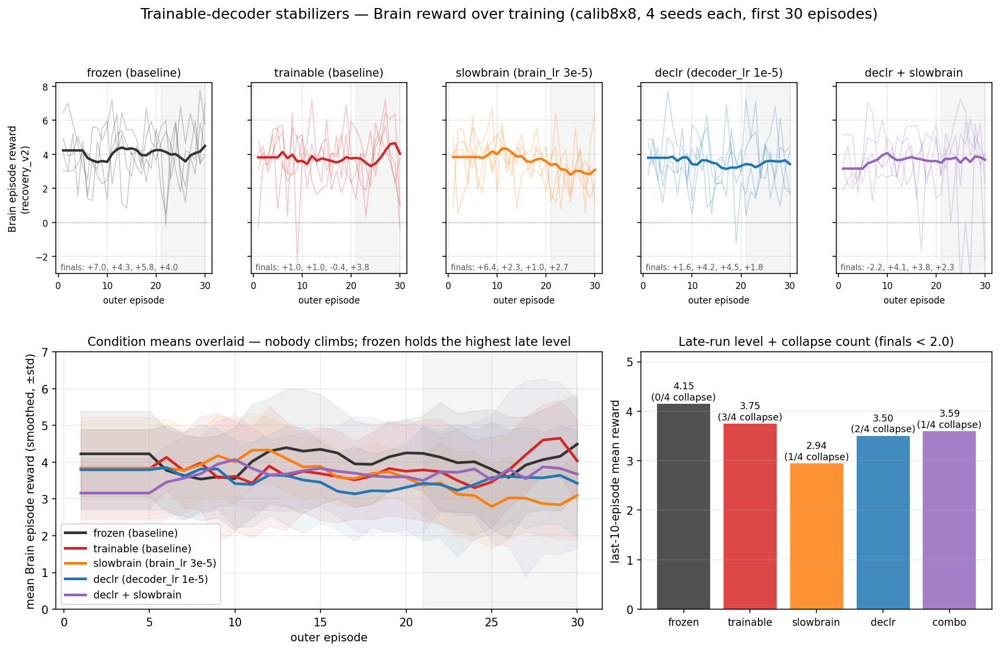
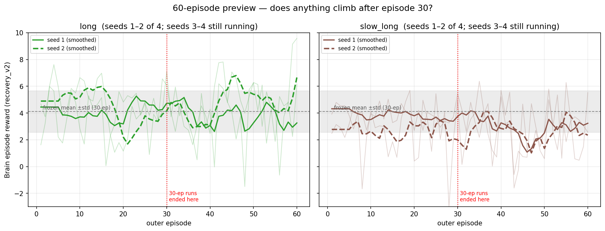

# 0002 — Stabilizing the Trainable Neuromodulation Decoder

**Status:** 🟡 PARTIAL 2026-07-01 — 30-ep conditions resolved (**H1 not supported**: stabilizers
temper the collapse but never beat frozen); `long`/`slow_long` (60-ep) still running, results to
be slotted in below.
**Owner:** Elijah · **Relates to:** [note 0001](./0001-trainable-vs-frozen-decoder.md) (the parent
negative result + R1), [plan](../multi_agent/0001-reduce-gpu-artifacts.md) (cloud ops used here),
`scripts/run_seed_sweep.py::CONDITIONS` (where these conditions live).

## Hypothesis (one sentence)

> The trainable decoder's failure in note 0001 was **instability from two co-adapting learners**
> (risk R1), not a dead mechanism — so damping the co-adaptation (slower Brain, decoupled decoder
> LR) and/or extending training should recover the trainable decoder's performance past frozen.

## Design

Five conditions, calib8x8, seeds 1–4 each, vs the note-0001 baselines (frozen 0.5105 /
hit_rate_80 0.926; trainable 0.5092 / 0.799):

| condition | change | tests |
| --- | --- | --- |
| `..._slowbrain` | `brain_lr` 1e-4 → 3e-5 | slower controller = more stationary target for decoder |
| `..._declr` | new `--neuromod_decoder_lr 1e-5` (separate Adam param group; decoder no longer rides the Brain-controlled inner LR — see ppo `train.py`) | decouple the two learners directly |
| `..._long` | `brain_episodes` 30 → 60 | "just needs more time" (control) |
| `..._slow_long` | both of the above | stabilize AND extend |
| `..._declr_slowbrain` | declr + slowbrain | do the two clean levers stack? |

## Results (30-episode conditions, 2026-07-01)

| condition | composite [CI/range] | hit_rate_80 | last-10 reward | collapses (final < 2.0) |
| --- | --- | --- | --- | --- |
| frozen (baseline) | 0.5105 [0.499, 0.523] | **0.926** | **4.15** | **0/4** |
| trainable (baseline) | 0.5092 [0.505, 0.513] | 0.799 | 3.75 | 3/4 |
| slowbrain | 0.5102 [0.503, 0.517] | 0.835 | 2.94 | 1/4 |
| declr | 0.5076 [0.502, 0.514] | 0.825 | 3.50 | 2/4 |
| declr_slowbrain | 0.5125 [0.505, 0.521] | 0.842 | 3.59 | 1/4 |
| long (60 ep) | _pending_ | | | |
| slow_long (60 ep) | _pending_ | | | |

Trajectory metrics (first 30 eps, per-seed series in
`sweeps/cloud_tvf_results/reward_series_stab.json`): slopes ≈ 0 everywhere (slowbrain −0.044/ep,
actively declining); late-window std 1.2–1.8 in every condition (combo highest at 1.84); frozen's
finals all in the +4.0…+7.0 band, every trainable variant has ≥1 seed below +2.0 (combo's worst
final −2.2 is the worst single seed anywhere).

## Interpretation

1. **The collapse is tempered, not cured.** Collapse frequency drops 3/4 → 1–2/4 under every
   stabilizer, so the levers bite on the failure mode — but none restores frozen's clean profile,
   and the underlying volatility never shrinks (the variance is reshaped, not removed).
2. **Stability is bought with plasticity.** slowbrain suppresses blowups *and* adaptation
   (negative slope, lowest late level 2.94). No stabilizer matches even vanilla trainable's late
   level, let alone frozen's.
3. **Nothing climbs.** All slopes ≈ 0 → there is no upward trajectory for extra episodes to
   extend. Prediction registered before the 60-ep runs land: `long`/`slow_long` confirm the null.
4. **Composite never moves** (all ~0.508–0.513, CIs overlap) — consistent with note 0001's
   conclusion that the Brain's scalar-HP control, not the context-code routing, drives adaptation.

**Conclusion so far:** the two-learner instability looks **intrinsic to this decoder-training
setup within the LR-lever family**, not a tuning artifact. You can trade collapse frequency
against learning speed, but no point on that trade-off beats the frozen decoder on any metric
(composite, hit_rate_80, late-run level, collapse count). This strengthens the note-0001 negative
result: 5 trainable variants now fail to beat frozen, not 1.

## What this rules in/out for next steps

- **Ruled out (here):** LR-family stabilizers as the missing ingredient; "just run longer" is
  near-ruled-out pending the 60-ep confirmation.
- **Still open (mechanism family, per note 0001):** affine/gain masks instead of suppress-only,
  input-conditioned (FiLM) modulation, actor/critic-separate modulation, larger context dims.
  If the autoresearch loop explores this territory, it should start there — not at LR tuning.

## Ops footnote

Run on the 4×3090 Vast box, one condition per GPU (`CUDA_VISIBLE_DEVICES`), combo squeezed into
spare capacity at ~zero cost (measured ~1.5 cores + ~1.6 GB VRAM per cell — see
`AUTORESEARCH.md` → cloud notes). Results auto-pushed to the `results` branch.

## 60-ep preview (seeds 1–2 only, 2026-07-01 — logged against the registered prediction)

| cell | ep1–30 mean | ep31–60 mean | slope (31–60) | last-10 | final |
| --- | --- | --- | --- | --- | --- |
| long_s1 | 4.20 | 3.72 | −0.004 | 3.70 | +6.1 |
| **long_s2** | 4.37 | **4.91** | **+0.105** | **5.43** | **+9.6** |
| slow_long_s1 | 3.86 | 2.86 | −0.011 | 3.18 | +2.6 |
| slow_long_s2 | 2.65 | 2.73 | −0.006 | 3.21 | +5.5 |

- **Prediction holds for `slow_long`:** flat/declining, late level ~2.8 — well below frozen.
- **Prediction challenged by `long_s2`:** genuine climb over eps 31–60 (+0.105/ep), last-10 mean
  5.43 (above frozen's 4.15), and final +9.6 — the highest single-episode reward anywhere in the
  experiment, hit at ep 60. `long_s1` is flat but healthy (+6.1 final).
- **No collapses in the extended window** (all 4 previewed finals ≥ +2.6) — raising the
  possibility that the ep-30 "collapse" in the 30-ep trainable runs is partly transient
  volatility a longer horizon rides out, not a terminal divergence.
- Caveats: n=2 per condition; Brain reward ≠ composite (composite averages *all* episodes, so a
  late climb is diluted); one climbing seed is ~2σ against these noise levels. Seeds 3–4 decide.

---
_Final 60-ep outcomes (seeds 3–4) to be appended when `tvf2_long` / `tvf2_slow_long` finish
(~9 h)._
