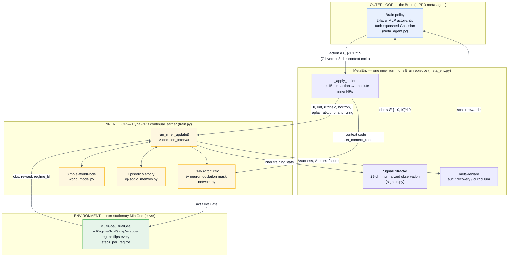
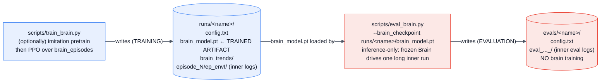
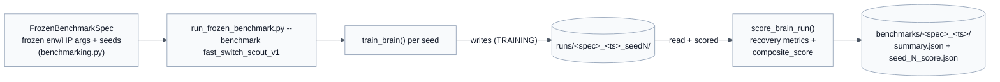
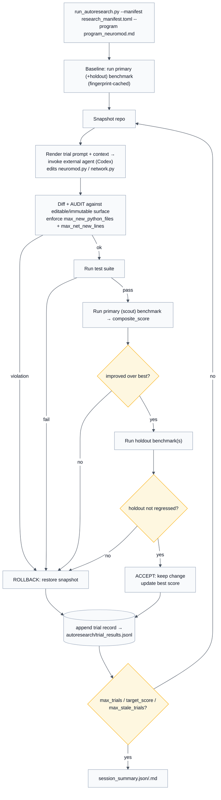

# 01 — Research Flow

This is the map. It shows how the pieces connect at three zoom levels:

1. **The two-level RL system** — Brain ⟷ inner Dyna-PPO ⟷ MiniGrid.
2. **The inner Dyna-PPO update cycle** — what one inner step actually does.
3. **The research lifecycle** — how a **run** (training) becomes an **eval**, and how the
   **autoresearch supervisor** drives bounded research trials over a frozen benchmark.

All diagrams are [Mermaid](https://mermaid.js.org/) and render in GitHub and VS Code.

---

## 1. The two-level (double-RL) system

The **outer Brain** treats one full **inner training run** as a single RL episode. Each
outer step ([`MetaEnv.step`](../../src/lifelong_learning/agents/brain/meta_env.py#L218))
runs `decision_interval` inner PPO updates, then hands the Brain a 19-dim summary and
takes a 15-dim action back.

**Key interface facts** (all in
[meta_env.py](../../src/lifelong_learning/agents/brain/meta_env.py)):

- Observation space: `Box(-10, 10, shape=(19,))` — see [signals.py `SIGNAL_NAMES`](../../src/lifelong_learning/agents/brain/signals.py#L14).
- Action space: `Box(-1, 1, shape=(15,))` — layout in [neuromod.py](../../src/lifelong_learning/agents/brain/neuromod.py#L11-L17): indices `0:7` are scalar levers, `7:15` are the neuromodulation context code.
- The action maps **linearly to absolute hyperparameter bounds** ([`_apply_action`](../../src/lifelong_learning/agents/brain/meta_env.py#L325)), *not* multiplicatively — see [04-outer-brain-and-metaenv.md](./04-outer-brain-and-metaenv.md).
- A Brain episode `terminated` when the inner run reaches its `total_timesteps` ([`done`](../../src/lifelong_learning/agents/brain/meta_env.py#L265)).

---

## 2. The inner Dyna-PPO update cycle

One call to
[`run_inner_update`](../../src/lifelong_learning/agents/ppo/train.py#L321) is the atomic
unit the Brain controls. It runs these phases in order:

```mermaid
%%{init: {'themeVariables': {'fontSize': '14px', 'textColor': '#111827', 'lineColor': '#4b5563', 'edgeLabelBackground': '#ffffff'}}}%%
flowchart LR
    A["Phase A — Collect real experience<br/>num_steps × num_envs<br/>surprise = CE(next-state) + MSE(reward)<br/>intrinsic = clip(surprise·intrinsic_coef)<br/>buffer ← extrinsic + intrinsic"]
    GAE["GAE<br/>advantages + returns"]
    B["Phase B — PPO on real data<br/>update_epochs × minibatches<br/>(+ optional anchoring KL)"]
    B2["Phase B2 — Replay<br/>if replay_ratio > 0.01:<br/>mix fresh + episodic memory<br/>(prioritized to older regimes)"]
    C["Phase C — Train world model<br/>CE(state) + MSE(reward)"]
    ARCH["Archive rollout<br/>→ EpisodicMemory"]
    D["Phase D — Dream<br/>WM rolls out imagined_horizon steps<br/>PPO update on imagined data<br/>(gradients blocked to WM)"]
    LOG["Log charts/* + brain/*<br/>checkpoint every N updates<br/>return stats dict"]

    A --> GAE --> B --> B2 --> C --> ARCH --> D --> LOG

    classDef default fill:#f8fafc,stroke:#94a3b8,color:#111827;
```

- A **regime switch** is detected inside Phase A and snapshots the
  [`anchor_model`](../../src/lifelong_learning/agents/ppo/train.py#L391-L395) used by the
  anchoring penalty.
- `"passive"` mode zeroes the surprise/intrinsic signal
  ([train.py](../../src/lifelong_learning/agents/ppo/train.py#L422)); `"dyna"` mode is the
  full loop above.
- Detail and the meaning of every signal returned: [03-inner-dyna-ppo.md](./03-inner-dyna-ppo.md).

---

## 3. The research lifecycle: run → eval, and autoresearch

### 3a. A single run and its eval

This is the distinction this spec hammers on: **`runs/` is where the Brain is trained;
`evals/` is where a trained Brain is measured.** Full directory contract in
[06-runs-and-evals.md](./06-runs-and-evals.md).

### 3b. The frozen benchmark

[`scripts/run_frozen_benchmark.py`](../../scripts/run_frozen_benchmark.py) is a *scored*
training run: for each frozen seed it calls `train_brain()` (so the training output still
lands in `runs/`), then scores that run and writes the report to `benchmarks/`.

### 3c. The autoresearch supervisor (Karpathy-style bounded loop)

[`AutoresearchSupervisor`](../../src/lifelong_learning/research/autoresearch.py#L553)
drives an **external coding agent** (Codex) through bounded, append-only trials. The agent
may edit only a narrow **editable surface** (neuromodulation code); the benchmark, scorer,
and environment are **immutable**. Each trial that fails any gate is rolled back.

Each trial writes its artifacts under `autoresearch/<session>/trial_<NNN>/`
(`research_prompt.md`, `trial_context.json`, `agent_notes.md`, `codex_final_message.md`,
logs). Full mechanics, the editable/immutable surface, and the manifest schema:
[07-benchmarking-and-autoresearch.md](./07-benchmarking-and-autoresearch.md).

---

## How the layers nest (one sentence each)

- **Environment** flips the rewarded goal on a fixed schedule → forgetting becomes visible.
- **Inner Dyna-PPO** tries to relearn fast after each flip without erasing old skills.
- **Outer Brain** watches the inner learner and tunes its plasticity (HPs + neuromodulation) to recover faster.
- **Frozen benchmark** turns "did the Brain recover faster?" into a single reproducible `composite_score`.
- **Autoresearch** lets an external agent propose neuromodulation changes and keeps only the ones the frozen benchmark says helped.
