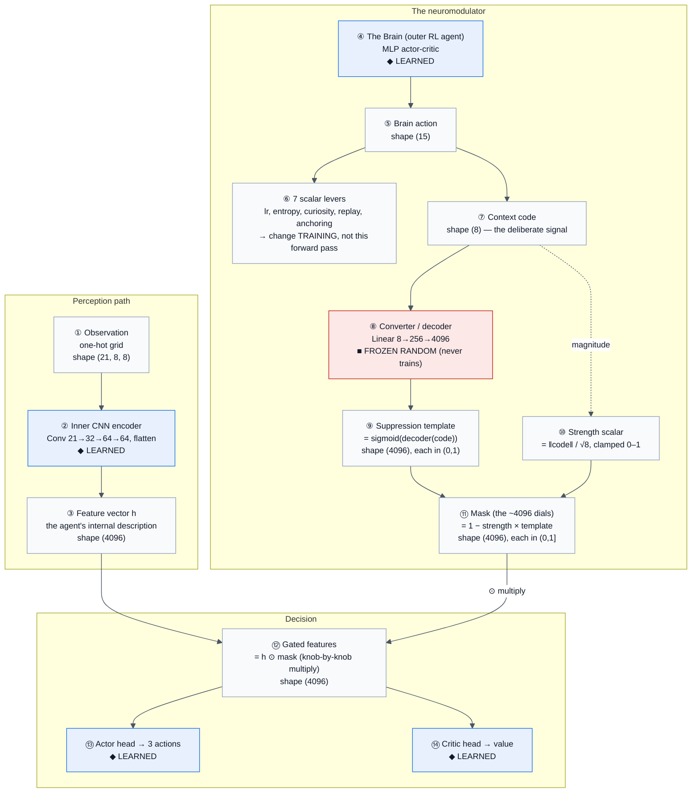

# Neuromodulation — Box Diagram (forward pass)

A block-level view of how the Brain's context code becomes a feature mask that reshapes the
inner agent's computation. Shapes shown are for the **8×8 grid** (`flatten = 64·8·8 = 4096`;
for 5×5 it is `64·5·5 = 1600`). Colours: **blue = learned**, **red = frozen-random**,
**grey = computed / data**.

Companion to [05-neuromodulation.md](./05-neuromodulation.md). Source:
[network.py](../../src/lifelong_learning/agents/ppo/network.py),
[neuromod.py](../../src/lifelong_learning/agents/brain/neuromod.py).

## Box reference

| # | Box | Shape | Status | What it does |
| --- | --- | --- | --- | --- |
| ① | Observation | (21, 8, 8) | data | One-hot encoding of the grid the inner agent sees. Regime is **not** encoded here. |
| ② | Inner CNN encoder | — | **learned** | 3 conv layers → flatten; the inner agent's perception. |
| ③ | Feature vector `h` | (4096) | computed | The agent's internal description of the current situation. |
| ④ | The Brain | — | **learned** | Outer PPO agent; trained to make the inner agent recover fast after regime switches. |
| ⑤ | Brain action | (15) | computed | The Brain's output: 7 scalar levers + 8-d context code. |
| ⑥ | 7 scalar levers | (7) | computed | lr / entropy / curiosity / imagined-horizon / replay-ratio / replay-prio / anchoring. Change **training dynamics**, not this forward pass. Most of the measured benefit lives here. |
| ⑦ | Context code | (8) | computed | The deliberate modulation signal the Brain chooses. **Learned choice**, not random. |
| ⑧ | Converter / decoder | 8→256→4096 | **frozen random** | Expands 8 numbers into 4096. Weights are orthogonal-init and **never receive gradient** — the mask enters `forward` as a detached buffer. See [05](./05-neuromodulation.md). |
| ⑨ | Suppression template | (4096) | computed | `sigmoid(decoder(code))`; per-feature "how much to suppress" in (0,1). |
| ⑩ | Strength scalar | (1) | computed | `‖code‖ / √8`, clamped to [0,1]; a global "how hard to modulate" knob. **`code = 0 ⇒ strength = 0 ⇒ mask = all ones`** (unmodulated). |
| ⑪ | Mask (the dials) | (4096) | computed | `1 − strength × template`, each in (0,1]. One volume knob per feature (suppress-only; can't boost above 1). |
| ⑫ | Gated features | (4096) | computed | `h ⊙ mask` — element-wise. The single point of contact. |
| ⑬ | Actor head | →(3) | **learned** | Policy over {turn-left, turn-right, forward}. |
| ⑭ | Critic head | →(1) | **learned** | State-value estimate. Shares ⑫ with the actor → a code change moves both. |

## Talking points

- **⑦→⑧→⑪** is the "8 numbers → 4096 dials" expansion. Box ⑧ (red) is the *only* frozen-random
  piece; the Brain must learn to steer through it without being able to reshape it.
- **⑩** means the code's *magnitude* is an implicit on/off dial: a zero code ⇒ identity mask ⇒
  the inner network runs exactly as if there were no neuromodulation.
- **⑥ vs ⑦–⑪**: the levers (⑥) change *how the agent trains*; the code path (⑦–⑪) changes *how it
  computes right now*. In the current results the levers do most of the heavy lifting.
- **The open experiment**: unfreeze ⑧ (make the converter co-adapt with the Brain) and measure
  whether neuromodulation then pulls its weight — see
  [docs/plans/workshop-task-free-neuromodulation.md](../plans/workshop-task-free-neuromodulation.md) §3a.
